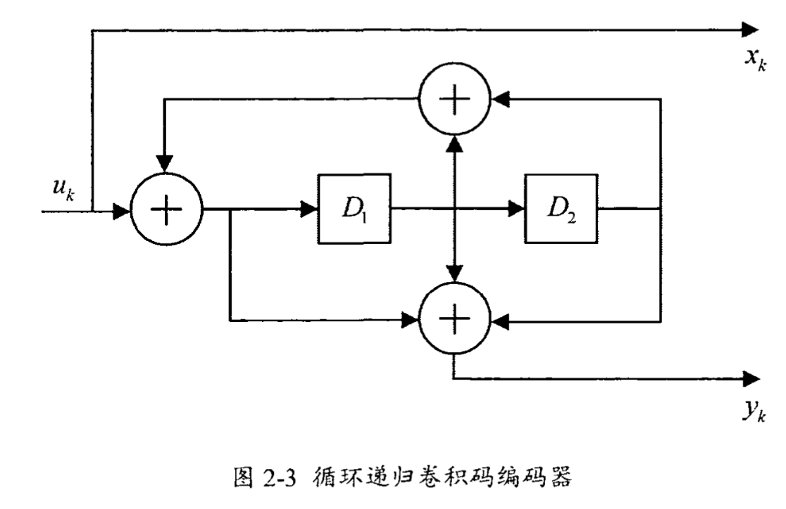

# 卷积码概念

## 一、基本概念

​	卷积码编码参数（k，n，L）， 其中k表示输入比特数，n表示输出比特数，卷积码编码效率为k/n，L表示约束长度，即移位寄存器的数量加1。

​	卷积码是线性的，在同一编码器条件下，输入$x_1(n)$和$x_2(n)$序列，输出的码字为$Y_1$和$Y_2$，如果将两个输入序列模2加送入编码器那么输出结果为两输出序列的模2加。

### 1、卷积码编码

#### （1）、卷积码的寄存器模型

#### （2）、卷积码的编码

​	假设输入序列x(n)为[1 1 1 0 1]，输入序列的脉冲响应为：
$$
g_1(n) = x(n)+x(n-1)\\g_2(n) = x(n)+x(n-2)\\g_3(n) = x(n)+x(n-1)+x(n-2)
$$
​	即：
$$
g_1(n)=(110)\\g_2(n)=(101)\\g_3(n)=(111)
$$
​	输出为：
$$
y_1(n) = x(n)*g_1(n)\\y_2(n) = x(n)*g_2(n)\\y_3(n) = x(n)*g_3(n)
$$
​	其多项式形式如下：
$$
X(D) = 1+D+D^2+D^4\\G_1(D)=1+D\\G_2(D)=1+D^2\\G_3(D)=1+D+D^2
$$
​	卷积码的生成矩阵为：
$$
G(D)=\begin{bmatrix}G_1(D)&G_2(D)&G_3(D)\end{bmatrix}
$$
​	输出形式为：
$$
Y(D)=X(D)G(D)\\Y(D)=\begin{bmatrix}Y_1(D)&Y_2(D)&Y_3(D)\end{bmatrix}
$$

#### （3）、恶性卷积码(Catastrophic Convolutional Codes)

​	如果卷积码编码器在输入非0序列的情况下生成了全0输出序列则成为恶性卷积码，恶性码可能会出现对于接收到少量的码字错误的序列从而导致无限数量的数据错误。

**恶性卷积码的判决定理**：

​	1/n卷积码的当且仅当生成多项式的最大公约数为$D^l$，那么该卷积码不是恶性卷积码。

即：
$$
GCD(G_0(D),G_1(D),\dots,G_{n-1}(D))=D^l
$$

### 2、卷积码分类

卷积码分类包括**系统卷积码**和**非系统卷积码**以及**递归卷积码**和**非递归卷积码**。

**系统卷积码**的输入数据出现在码序列中的一部分，**递归卷积码**存在反馈连接。

- 系统卷积码的编码器的构造

  系统卷积码的生成矩阵为：
  $$
  G(D)=[g_1(D)\quad g_2(D)]=[1+D^2\quad 1+D+D^2]
  $$
  其编码器框图如下：

  

- 递归系统卷积码

  递归系统卷积码的生成矩阵为：
  $$
  G(D)=\begin{bmatrix}1&\frac{g_2(D)}{g_1(D)}\end{bmatrix}=\begin{bmatrix}1&\frac{1+D^2}{1+D+D^2}\end{bmatrix}
  $$
  其中，$g_1(D)$为反馈多项式，$g_2(D)$为前馈多项式。递归系统卷积码编码器如下：

  

  递归卷积码在卷积码编码基础上增加反馈位，具体代码实现见TurboCodeEst库中test文件夹。

### 3、卷积码的结构特性

#### （1）、状态图

​	卷积码包含$2^{L-1}$种可能的状态，编码器的状态只能在可能状态中进行转换，其中$(1,3,2)$卷积码的状态图如下：

#### （2）、卷积编码器的传递函数

​	参考书籍《数字通信》。

#### （3）、格型图

​	状态图不包含时间信息，在解码时时间信息被需要，因此格型图可以克服状态图没有时间信息的缺陷。

​	状态图如下：

​	对应的格型图如下：

## 二、进阶概念

### 1、删余卷积码(Punctured Convolutional Codes)

​	暂未使用

### 2、终止(Terminated)

​	卷积码编码器的起始状态默认为零，如果不使用终止编码，那么在卷积编码结束时将无法得知寄存器的最终状态，在这种情况下卷积码在译码时复杂度将会增加，译码性能会有所损失。

#### （1）、零尾编码(Zeros-Tail Encoding)

- 非递归卷积码零尾编码

  ​	直接在信息比特后加入寄存器个数个零，当卷积编码结束时寄存器刚好处于零状态。

  

- 递归卷积码零尾编码

  ​	递归卷积码编码器的零尾编码较复杂，因为有反馈的存在，因此直接在信息比特后加零编码结束寄存器状态不会被置零。解决办法是在信息比特结束时记录寄存器状态，生成反馈，将反馈作为尾比特加入信息码之后，那么在信息码编码结束时，相同比特异或就会出现零比特，那么递归卷积码的零尾编码就实现了。具体实现代码见[递归卷积码零尾编码](../TurboCodeEst/test/turboenc.m)。

  

#### （1）、咬尾编码(Tail-Biting Encoding)

​	咬尾卷积编码克服了由零尾导致的编码效率损失。

​	在卷积编码时，寄存器的结束状态要和初始状态一致，在正常情况下，寄存器的初始状态为0，那就需要在输入比特的结尾补L-1个0。假设k=1，n=2输入比特长度为m，在补零的情况下输出比特数为2（m+L-1），那么编码效率为$R_{eff}=\frac{km}{n(m+L-1)}=R\frac{m}{m+L-1}$，编码效率损失了$\frac{m}{m+L-1}$倍，因此出现了咬尾编码。

- 非递归卷积码咬尾编码

  ​	非递归咬尾编码将输入比特的最后L-1位作为寄存器的初始状态，目的是确保寄存器的初始状态和结束状态相同，舍弃前L-1比特的输出，即可保证编码效率没有损失。

  

- 递归卷积码咬尾编码

  暂未涉及

### 三、卷积码译码

#### （1）、Viterbi

