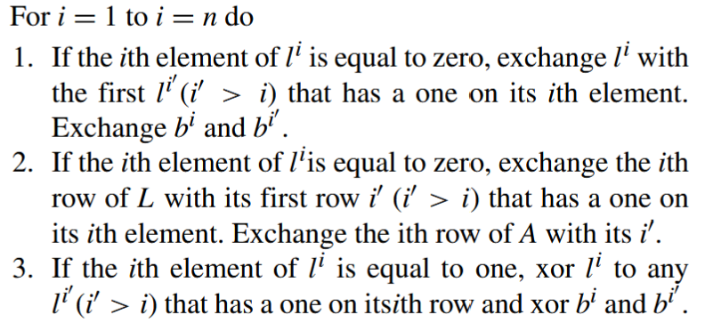
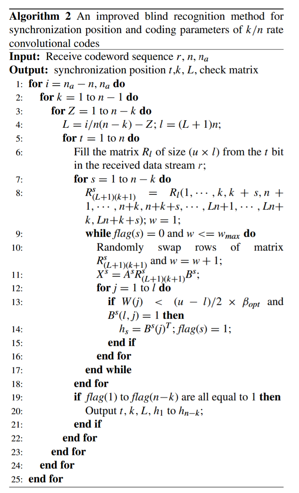

# 卷积码盲识别算法

该算法实现了卷积码同步位置的识别，以及卷积码约束长度L、码率$k/n$以及校验矩阵H的估计。

## 一、码长识别

### 1、[GJETP算法](./data/references/An_Improved_Blind_Recognition_Method_of_the_Convolutional_Interleaver_Parameters_in_a_Noisy_Channel.pdf)[^1]

​	使用**Gauss-Jordan elimination through pivoting (GJETP)**算法求矩阵的秩探讨线性相关性。

​	假设X为$u\times l$维矩阵，让矩阵$L=X$，初始化两个单位矩阵A和B，A的维数为$u\times u$，B的维数为$l\times l$，$z^i$表示矩阵Z的第$i$列，将矩阵$L$化为下三角矩阵，形式如下：
$$
L=AXB
$$
算法总共包含三步如下：

该算法的具体代码实现见[gjetp.m](./src/gjetp.m)。

### 2、[码长识别算法](./data/references/Blind recovery of kn rate convolutional encoders in a noisy environment.pdf)[^2]

​	从任意时刻截取的卷积码逐行填充到$u\times l$维的矩阵$R_l$中，设置$u$足够大。

当存储的矩阵满足下面的条件：

- $R_l$的列数等于码长的整数倍，即$l=\alpha n$，其中$\alpha>\lfloor L/(n-k)+1\rfloor$。
- $R_l$中的第一个比特为码字的第一个比特。

- 在传输中无误码。

那么，$R_l$的秩$rank(R_l)=\alpha k+L$，否则$R_l$的秩为$l$。

假设填充的矩阵$R_l$使用GJETP算法化为下三角矩阵X：
$$
X=AR_lB
$$
$X_{low}$为矩阵X从$l+1$行到最后的矩阵。在无误码环境下，如果$X_{low}$的某些列全为零，则意味着这些列为矩阵的线性相关列。如果存在误码，这些列可能出现极少量1，遍历$l$，如果某个矩阵$X_{low}$的汉明重量小于门限值，则记录当前的$l$值，所有记录的$l$值的最小值就是$n_a$，两个相邻$l$的差值就是估计的码长$n$。

具体实现代码见**src**文件夹下的[cclbr.m](./src/cclbr.m)。

## 二、[参数盲识别算法](./data/references/An_Improved_Blind_Recognition_Method_for_Synchronization_Position_and_Coding_Parameters_of_k_n_Rate_Convolutional_Codes_in_a_Noisy_Environment.pdf)[^3]

算法具体步骤如下：

**步1**：$i$的值为$n_a$或者$n_a-n$，初始化为$n_a$。当接收序列同步时，$n_a=n_a$，当接受序列不同步时，获得的$n_a$大于$n$，那么$n_a=n_a-n$。然后执行步2。

**步2**：设置信码长度k的最大值为$n-1$，最小值为1，初始化$k=1$。执行步3。

**步3**：设置秩亏$Z$的最大值为$n-k$，最小值为1，$Z$初始化为1，卷积码长度$L=n_a/n(n-k)-Z$，然后执行步4。

**步4**：设置同步位置$t$的最大值为$n$，最小值为1，初始化为1。当未知同步位置的接收序列为$r=(r_1,r_2,\cdots)$，从t比特开始的数据流为$r^t=(r_t,r_{t+1}，\cdots)$，然后执行步5。

**步5**：将数据$r^t$排列进$u\times l$维的矩阵$R_l$中，其中$l=(L+1)n$并且$u\ge2l_{max}$。实际上，卷积码的参数很小。设置$n_{max}=5,L_{max}=9$，然后设置$u=100$。执行步6

**步6**：设置校验矩阵行的最大值为$n-k$，最小值为1，初始化为1，将矩阵$R_l$重新排列进矩阵$R_{(L+1)(k+1)}^s$，其中$R_{(L+1)(k+1)}^s=R_l(1,\cdots,k,k+s,n+1,\cdots,n+k,n+k+s,\cdots,Ln+1,\cdots,Ln+k,Ln+k+s)$然后执行步7。

**步7**：随机交换矩阵的行，设置迭代次数为$w$，其最大值为10，最小值为1，初始化$w$为1。随机交换矩阵$R_{(L+1)(k+1)}^s$的行，然后$w=w+1$，然后执行步8。

**步8**：对矩阵$R_{(L+1)(k+1)}^s$执行GJETP算法，得到$X^s=A^sR^s_{(L+1)(k+1)}B^s$，然后执行步9。

**步9**：将变量$j$从1增加到$l$。如果$W(j)<(u-l)/2\times\beta_{opt}$并且$B^s(l,j)=1$。那么$B^s$的第$j$列就是卷积码的第$s$个准校验向量并让$flag(s)=1$，$flag(s)=1$表示估计出了第s个准校验向量。当$j=l$，如果$flag(s)=0$并且$w\le10$那么执行步7，否则执行步10。

**步10**：如果$s<s_{max}$，令$s=s+1$，执行步6，否则执行步11。

步11：如果$flag(1)$到$flag(n-k)$均为1，表示已经估计出了卷积码所有的准校验向量，输出$t,k,L,h_0,\cdots,h_{n-k}$，然后执行步12。

**步12**：如果$t<t_{max}$，设置$t=t+1$，执行步4，否则执行步13。

**步13**：如果$Z<Z_{max}$，令$Z=Z+1$，执行步3，否则执行步14。

**步14**：如果$k<k_{max}$，令$k=k+1$，执行步2，否则执行步15。

**步15**：如果$i>n_a-n$，令$i=i-n$，执行步1，否则算法结束。

该算法的伪代码如下：

该算法的具体代码实现见**src**文件夹下的[ccpbrV2.m](./src/ccpbrV2.m)。

## 参考文献

[^1]: Marazin, M., Gautier, R. & Burel, G. Blind recovery of *k/n* rate convolutional encoders in a noisy environment. *J Wireless Com Network* **2011**, 168 (2011).
[^3 ]:Y. Xu, Y. Zhong and Z. Huang, "An Improved Blind Recognition Method of the Convolutional Interleaver Parameters in a Noisy Channel," in IEEE Access, vol. 7, pp. 101775-101784, 2019, doi: 10.1109/ACCESS.2019.2930663. 
[^3]: Y. Ding, Z. Huang and J. Zhou, "An Improved Blind Recognition Method for Synchronization Position and Coding Parameters of k/n Rate Convolutional Codes in a Noisy Environment," in IEEE Access, vol. 8, pp. 171305-171315, 2020, doi: 10.1109/ACCESS.2020.3025177.